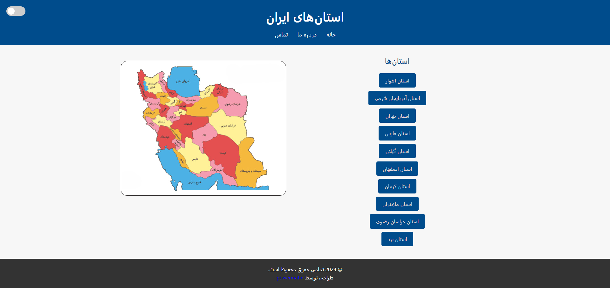

## [فارسی | Persian](README_FA.md)

# 🌍 Iran Provinces Interactive Map

A modern, interactive web project showcasing Iran's provinces with detailed information about each region, accompanied by a dynamic and responsive map.

---

## 📌 Project Overview

This project allows users to explore the provinces of Iran through an interactive map. Each province is clickable, leading to a dedicated page with detailed descriptions and relevant images. The design is fully responsive and optimized for modern browsers.

### ✨ Features
- **Interactive Map**: Clickable regions for each province.
- **Detailed Information**: Each province has its own page with a comprehensive description and an image.
- **Modern Design**: A visually appealing and responsive user interface.
- **Easy Navigation**: Simplified structure for seamless exploration of provinces.

---

## 🚀 Live Demo

Check out the live version of the project here:  
[**Live Demo**](https://power0matin.github.io/iran-provinces/)

---

## 📸 Screenshots

### Homepage

---

## 🛠️ Tools and Technologies

- **HTML5**: For structuring the content.
- **CSS3**: For styling and layout.
- **GitHub Pages**: For hosting the live demo.

---

🌐 License
This project is licensed under the [MIT License](LICENSE).  
See the [LICENSE](LICENSE) file for more details.

📧 Contact
If you have any questions or suggestions, feel free to contact me via:
[Telegram](https://t.me/powermatin)

© 2024 All rights reserved. Designed and developed by power0matin.
