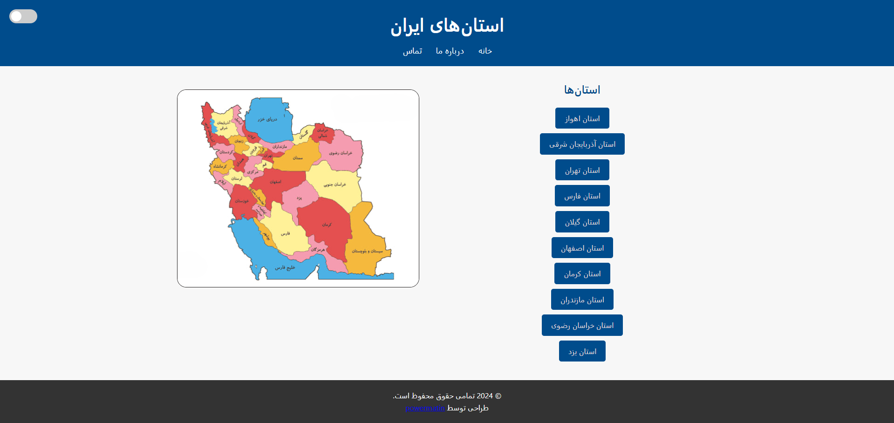
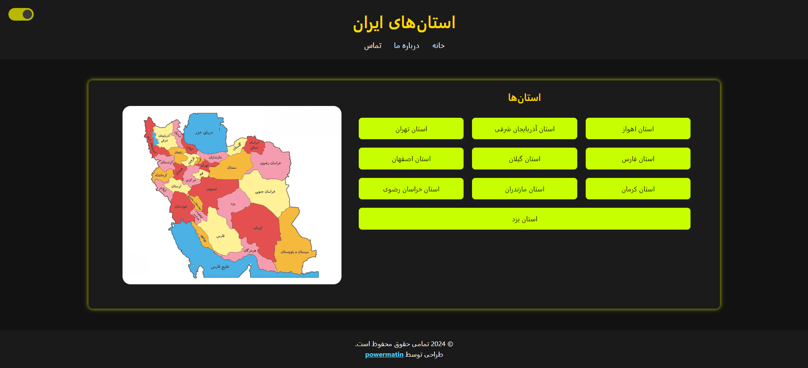

# 🌍 Iran Provinces — Interactive Map & Directory

[فارسی | Persian](README_FA.md)

[](https://power0matin.github.io/iran-provinces/)
[](LICENSE)


A modern, responsive, bilingual (FA/EN) web app to **explore Iran’s provinces** with a **clickable map**, **search**, **animated dark mode**, and **rich province pages** (intro, counties, cities, attractions). Built with vanilla HTML/CSS/JS for **zero-dependency** hosting—perfect for GitHub Pages.

## ✨ Highlights

- 🗺️ **Interactive map** with province deep links
- 🔍 **Keyboard-first search** (`/` to focus, `Esc` to clear)
- 🌓 **Animated dark mode** with system preference + persistence
- 🌐 **Full i18n**: Persian ⇄ English toggle, auto RTL/LTR + `dir`
- 📚 **Data-driven**: provinces from JSON (`data/provinces/index.json`)
- 📱 **Responsive** UI (sticky header, mobile drawer)
- ♿ **A11y**: focus rings, ARIA labels, high-contrast friendly
- ⚡ **Fast**: static assets only, clean CSS transitions

## 🧭 Table of Contents

- [Live Demo](#live-demo)
- [Screenshots](#screenshots)
- [Project Structure](#project-structure)
- [How It Works](#how-it-works)
- [Quick Start](#quick-start)
- [i18n (FA/EN)](#i18n-faen)
- [Dark Mode](#dark-mode)
- [Data Format](#data-format)
- [Add or Edit a Province](#add-or-edit-a-province)
- [Keyboard Shortcuts](#keyboard-shortcuts)
- [Contributing](#contributing)
- [Roadmap](#roadmap)
- [CI / Pages](#ci--pages)
- [License](#license)
- [Credits](#credits)

## 🚀 Live Demo

👉 **[https://power0matin.github.io/iran-provinces/](https://power0matin.github.io/iran-provinces/)**

> Designed for static hosting (GitHub Pages or any CDN).

## 📸 Screenshots

**Home**


**Dark mode**


## 🗂 Project Structure

```
iran-provinces/
├─ index.html           # Home (map + province list)
├─ province.html        # Province detail (intro, counties, cities, attractions)
├─ about.html
├─ contact.html
├─ css/
│  ├─ style.css         # Theme, layout, components
│  ├─ components.css    # Reusable UI (tabs, chips, cards, etc.)
│  └─ responsive.css    # Breakpoints
├─ js/
│  ├─ app.js            # Home page (map/list/search)
│  ├─ province.js       # Province page loader/renderer
│  ├─ darkMode.js       # Theme switch (animated, persisted)
│  └─ i18n.js           # Live translations + lang/dir sync
├─ data/
│  └─ provinces/
│     ├─ index.json     # All provinces metadata + content (SSOT)
│     └─ ...            # (optional per-province JSONs if split later)
├─ images/
├─ README.md
├─ README_FA.md
└─ LICENSE
```

## 🧠 How It Works

- **Home** fetches `data/provinces/index.json`, renders the **31 provinces** list, and binds map areas to `province.html?id=<slug>`.
- **Province detail** reads `id` from the query string, finds the object in `index.json`, then fills:

  - Chips: **capital**, **population**, **area**
  - **Intro** & **hero** image
  - **Counties** accordion (each with **cities**)
  - **Cities** & **Attractions** tiles

- **i18n**: updates `[data-i18n]` nodes and toggles `<html lang>` and `dir` (`rtl`/`ltr`).
- **Dark mode**: respects `prefers-color-scheme` and persists via `localStorage`.

## ⚡ Quick Start

```bash
# 1) Clone
git clone https://github.com/power0matin/iran-provinces.git
cd iran-provinces

# 2) Serve locally (choose one)
npx serve .
npx http-server .
python3 -m http.server

# 3) Open in browser
# http://localhost:5000   (or whatever your tool prints)
```

> Due to `fetch()` security, opening `index.html` via **file://** may block JSON loading—use a tiny local server.

## 🌐 i18n (FA/EN)

- Use the **Language** toggle in the header to switch **Persian ⇄ English**.
- `i18n.js`:

  - Updates all `[data-i18n]` texts on the fly
  - Sets `html[lang="fa"|"en"]` and `dir="rtl"|"ltr"`
  - Persists choice in `localStorage`

<details>
<summary>Extend translations</summary>

Add keys to your i18n resources (inside `i18n.js`). Example keys:

- `nav.home`, `nav.about`, `nav.contact`
- `home.provinces`, `home.hint`
- `province.intro`, `province.counties`, `province.cities`, `province.attractions`
- `province.aboutTitle`, `footer.rights`

</details>

## 🌙 Dark Mode

- Toggle in header (animated knob + glow)
- Honors `prefers-color-scheme`
- Persists in `localStorage`
- Kept fully in sync with the UI

## 🗄 Data Format

All content comes from **`data/provinces/index.json`**:

```json
{
  "provinces": [
    {
      "id": "alborz",
      "nameFa": "البرز",
      "nameEn": "Alborz",
      "capital": "کرج",
      "population": 2712400,
      "areaKm2": 5122,
      "intro": "Intro text...",
      "hero": "images/alborz_1.jpg",
      "counties": [{ "name": "کرج", "cities": ["کرج", "ماهدشت"] }],
      "cities": ["کرج", "هشتگرد", "نظرآباد", "فردیس"],
      "attractions": ["جاده چالوس", "پیست دیزین"]
    }
  ]
}
```

**Required:** `id`, `nameFa`, `nameEn`
**Recommended:** `intro`, `hero`, `counties`, `cities`, `attractions`, `population`, `areaKm2`, `capital`

## ➕ Add or Edit a Province

1. Edit `data/provinces/index.json`.
2. Add/modify a province object (see schema).
3. Place images in `images/` and reference via `hero`.
4. Commit & push—Pages auto-publishes.

**Tip:** Keep `id` lowercase and URL-safe (`-` instead of spaces).

## ⌨️ Keyboard Shortcuts

- `/` → focus search
- `Esc` → clear search

## 🤝 Contributing

We welcome contributions!

**Conventional Commits** (recommended):

```
feat: add province Golestan data
fix(i18n): sync header label keys
chore(css): tidy responsive utilities
```

**PR Checklist**

- [ ] JSON validates & lints
- [ ] i18n keys updated for FA/EN
- [ ] Tested locally (home + province deep link)
- [ ] Screens OK in light & dark themes

> Consider opening an issue first for larger features.

## 🗺 Roadmap

- [ ] Province photo galleries
- [ ] Offline cache (Service Worker)
- [ ] Charts (e.g., population over time)
- [ ] Unit tests for loaders/renderers
- [ ] CSV/JSON export

## 🧩 CI / Pages

Deployed with **GitHub Pages** (Settings → Pages → _Deploy from_ `main`, `/`).

Optional CI for JSON validation and link checks:

```yaml
# .github/workflows/ci.yml
name: CI
on:
  push: { branches: [main] }
  pull_request: { branches: [main] }
jobs:
  validate:
    runs-on: ubuntu-latest
    steps:
      - uses: actions/checkout@v4
      - name: Validate JSON
        run: |
          sudo apt-get update && sudo apt-get install -y jq
          jq . data/provinces/index.json > /dev/null
      - name: Link Check (optional)
        uses: lycheeverse/lychee-action@v1
        with:
          args: --no-progress --accept 200,429 .
```

## 📜 License

Released under the **MIT License**.
See [LICENSE](LICENSE) for details.

## 📬 Contact

**Matin Shahabadi (متین شاه‌آبادی / متین شاه آبادی)**

* Website: [matinshahabadi.ir](https://matinshahabadi.ir)
* Email: [me@matinshahabadi.ir](mailto:me@matinshahabadi.ir)
* GitHub: [power0matin](https://github.com/power0matin)
* LinkedIn: [matin-shahabadi](https://www.linkedin.com/in/matin-shahabadi)

## 🙌 Credits

Designed & developed by **[@power0matin](https://github.com/power0matin)**.
Map image & province boundaries: public educational resources—open an issue if attribution needs adjustment.
