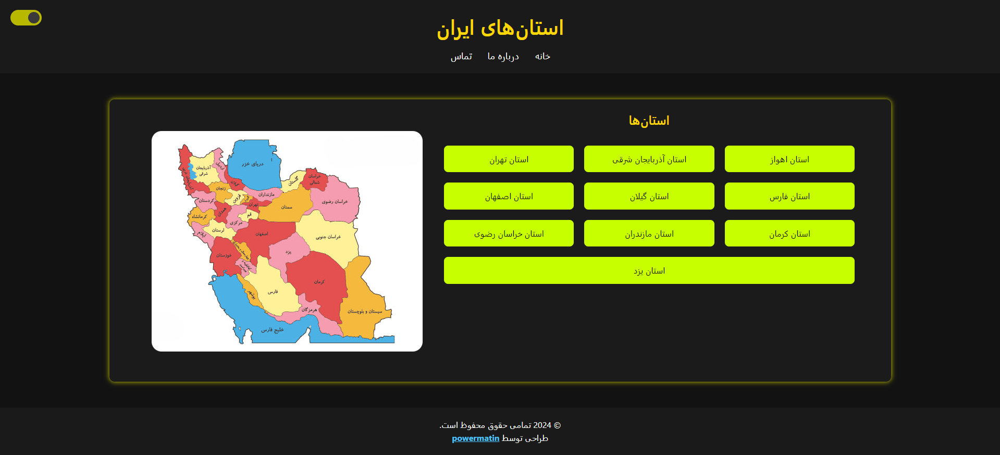

# 🌍 نقشه تعاملی استان‌های ایران

یک پروژه وب مدرن و تعاملی که استان‌های ایران را با اطلاعات جامع درباره هر منطقه و نقشه‌ای پویا و واکنش‌گرا به نمایش می‌گذارد.

---

## 📌 نمای کلی پروژه

این پروژه به کاربران امکان می‌دهد استان‌های ایران را از طریق یک نقشه تعاملی کاوش کنند. هر استان قابلیت کلیک دارد و به صفحه اختصاصی آن استان با توضیحات کامل و تصاویر مرتبط هدایت می‌شود. طراحی پروژه کاملاً واکنش‌گرا بوده و برای مرورگرهای مدرن بهینه شده است.

### ✨ ویژگی‌ها
- **نقشه تعاملی**: بخش‌های کلیکی برای هر استان.
- **اطلاعات جامع**: هر استان دارای صفحه‌ای با توضیحات کامل و تصویر است.
- **طراحی مدرن**: رابط کاربری زیبا و واکنش‌گرا.
- **ناوبری آسان**: ساختار ساده برای جستجوی بی‌دردسر بین استان‌ها.

---

## 🚀 نسخه زنده

نسخه زنده پروژه را از اینجا مشاهده کنید:  
[**مشاهده نسخه زنده**](https://power0matin.github.io/iran-provinces/)

---

## 📸 تصاویر
 
### ☀️ صفحه اصلی

### 🌑 حالت تاریک

---

## 🛠️ ابزارها و فناوری‌ها

- **HTML5**: برای ساختاردهی محتوا.
- **CSS3**: برای استایل‌دهی و طرح‌بندی.
- **GitHub Pages**: برای میزبانی نسخه زنده پروژه.

---

🌐 **لایسنس**  
این پروژه تحت مجوز [MIT License](LICENSE) منتشر شده است.  
جزئیات بیشتر را می‌توانید در فایل [LICENSE](LICENSE) مشاهده کنید.

📧 **تماس**  
اگر سوال یا پیشنهادی دارید، می‌توانید از طریق این لینک با من تماس بگیرید:  
[تلگرام](https://t.me/powermatin)

© 2024 تمامی حقوق محفوظ است. طراحی و توسعه توسط power0matin. 
